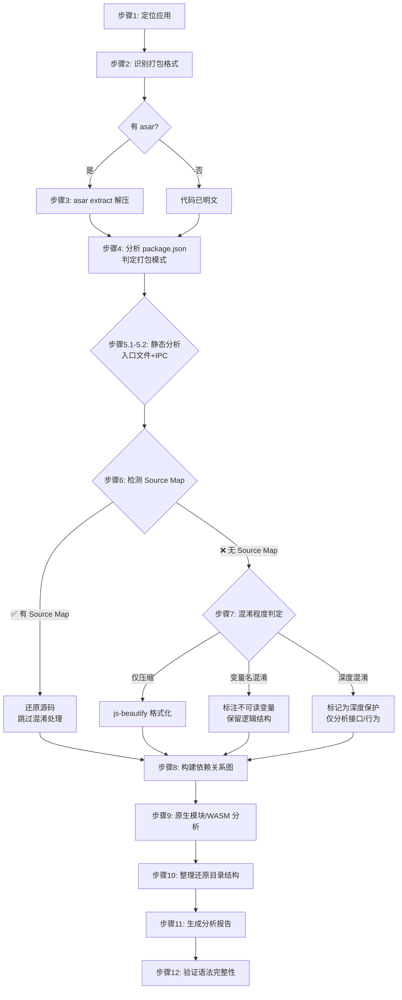

# 📋 Electron 应用分析与源码复原方案

> 一份 Agent 可逐步执行的专业级方案
> 覆盖现代 Electron 应用的各类打包模式、安全实践和反分析技术

---

## 零、前置知识：现代 Electron 应用的四种打包模式

分析前先识别目标应用的打包模式，不同的模式决定了后续的分析策略。

### 模式 A：未打包开发模式

```
app/
├── package.json        # main: "main.js"
├── main.js            # 源码，可直接阅读
├── preload.js
├── src/renderer/      # React/Vue 源码（可能有 .tsx/.vue）
└── node_modules/      # 依赖（可高达数百 MB）
```

**特征**：有 `.ts`/`.tsx` 文件、有 `node_modules/` 全量依赖
**可复原程度**：★★★★★（完整源码）

### 模式 B：Bundler 打包模式（主流，如 Proma）

```
app.asar
├── dist/
│   ├── main.cjs             ← esbuild 单文件打包
│   ├── preload.cjs          ← esbuild 单文件打包
│   └── renderer/            ← Vite/webpack 打包的 SPA
│       ├── index.html
│       └── assets/
│           ├── index-abc123.js     ← 代码分割 chunk
│           └── index-abc123.css
├── package.json              ← main: "dist/main.cjs"
└── node_modules/             ← 退出的（asarUnpack 中明确排除的模块）
```

**特征**：主进程/预加载为**单个 bundle**，渲染进程为**工程化打包产物**
**可复原程度**：★★★☆☆（可分析逻辑结构，源码级还原需 Source Map）

### 模式 C：ASAR 单文件打包（简单应用）

```
app.asar
├── package.json
├── main.js
├── preload.js
├── renderer/
│   ├── index.html
│   └── app.js
└── resources/
```

**特征**：ASAR 内为原始目录结构，JS/HTML 文件单独存在
**可复原程度**：★★★★☆（接近源码）

### 模式 D：深度保护模式（商业应用）

```
app.asar
├── main.js               ← 混淆/字节码化
├── preload.js            ← 混淆
├── renderer/             ← WASM/字节码
├── native/
│   └── core.node         ← 关键逻辑在原生模块
└── ...
```

**特征**：存在 `.jsc`/`.bytecode` 文件、混淆严重的 `.js`、`.node` 原生模块承载核心逻辑
**可复原程度**：★★☆☆☆（仅可分析接口和行为）

---

## 一、完整执行步骤（Agent 可逐步操作）

### 步骤 1：定位目标应用

```bash
# macOS
# /Applications/XXX.app/Contents/Resources/
# ~/Applications/XXX.app/Contents/Resources/

# Windows
# C:\Program Files\XXX\
# C:\Users\<用户名>\AppData\Local\Programs\XXX\
# C:\Users\<用户名>\AppData\Local\XXX\     ← Squirrel 安装
# C:\Users\<用户名>\scoop\apps\XXX\        ← Scoop 安装

# Linux
# /opt/XXX/
# /usr/lib/XXX/
# ~/.config/XXX/
# /snap/XXX/current/                       ← Snap 安装
# /var/lib/flatpak/app/XXX/                ← Flatpak 安装
```

**Agent 操作**：

```bash
# macOS：查找并输出 .app 包结构和可执行文件
echo "=== 应用基本信息 ==="
mdls -name kMDItemDisplayName -name kMDItemVersion /Applications/XXX.app 2>/dev/null
plutil -p /Applications/XXX.app/Contents/Info.plist 2>/dev/null | head -20
echo "=== 目录结构 ==="
find /Applications/XXX.app -maxdepth 4 -not -path "*/MacOS/*" -not -path "*/Frameworks/*"
```

**输出预期**：确认目标路径存在，记录 `Info.plist` 中的版本号和入口信息。

---

### 步骤 2：识别打包格式

```bash
# 2.1 查找 asar 文件
echo "=== ASAR 文件清单 ==="
find /path/to/app -name "*.asar" -type f 2>/dev/null

# 2.2 检测 node_modules 结构
echo "=== node_modules 检测 ==="
ls -la /path/to/app/node_modules/ 2>/dev/null | head -10
echo "--- 是否有 .bin 目录 ---"
test -d /path/to/app/node_modules/.bin && echo "有" || echo "无"

# 2.3 检测打包模式特征
echo "=== 打包模式判断 ==="
if [ -f /path/to/app/app.asar ]; then
  echo "模式 B/C：存在 asar 归档"
elif find /path/to/app -name "*.tsx" -o -name "*.ts" | grep -q .; then
  echo "模式 A：存在 TypeScript 源码"
elif find /path/to/app -name "*.jsc" -o -name "*.bytecode" | grep -q .; then
  echo "模式 D：存在 V8 字节码文件"
else
  echo "待进一步分析"
fi
```

**决策树**：

```bash
# Agent 根据结果进入对应分支：
case $PACKAGE_MODE in
  A) echo "直接进入步骤 4（代码已明文）" ;;
  B|C) echo "进入步骤 3（解压 asar）" ;;
  D) echo "进入步骤 3（尝试解压）并标记深度保护" ;;
esac
```

---

### 步骤 3：解压 ASAR 归档

```bash
# === 方法 A：@electron/asar 工具（唯一可靠方式）===
npm install -g @electron/asar@latest

# 3.1 预览 asar 内容清单
asar list app.asar | head -30

# 3.2 提取内容（保留原始目录结构）
asar extract app.asar ./extracted_app

# 3.3 验证解压完整性
echo "=== 解压结果 ==="
ls -la extracted_app/
echo "文件总数：$(find extracted_app -type f | wc -l)"
```

<details>
<summary><b>备用方案：Node.js 脚本解压（当 asar 工具不可用时）</b></summary>

```javascript
// asar 格式本质是 header + 文件内容拼接，以下是用 Node.js 逐字节解析的实现
// 注意：这会写入当前工作目录下的 extracted_app/
const fs = require('fs');
const path = require('path');

function extractAsar(asarPath, outputDir) {
  const buf = fs.readFileSync(asarPath);
  const headerStr = buf.slice(4, buf.readUInt32BE(0) + 4).toString('utf8');
  const header = JSON.parse(headerStr);
  const base = 4 + buf.readUInt32BE(0);
  
  function extractFiles(files, parentPath) {
    for (const [name, info] of Object.entries(files)) {
      const fullPath = path.join(outputDir, parentPath, name);
      if (info.files) {
        fs.mkdirSync(fullPath, { recursive: true });
        extractFiles(info.files, path.join(parentPath, name));
      } else {
        const offset = base + info.offset;
        const size = info.size;
        fs.mkdirSync(path.dirname(fullPath), { recursive: true });
        fs.writeFileSync(fullPath, buf.slice(offset, offset + size));
      }
    }
  }
  
  extractFiles(header.files, '');
}
```

**注意**：不推荐用 `tar` 命令或 Python `tarfile` 解压，asar 的文件头格式与标准 tar **不兼容**。
</details>

**Agent 操作**：

```bash
# 检查是否有 asarUnpack 目录（electron-builder 常见）
echo "=== asar 外部关键文件 ==="
find /path/to/app/resources -maxdepth 2 -type f 2>/dev/null
echo "=== extraResources（extraResources）==="
ls -la /path/to/app/resources/ 2>/dev/null
echo "=== 原生模块 ==="
find /path/to/app -name "*.node" -type f 2>/dev/null
```

---

### 步骤 4：分析 package.json + 打包模式判定

```bash
cat extracted_app/package.json
```

**Agent 提取关键字段**：

```json
{
  "name": "XXX",
  "version": "1.0.0",
  "main": "dist/main.cjs",          // ← 主进程入口（大概率指向 bundle）
  "type": "module",                  // ← ESM 格式
  "scripts": {                       // ← 构建工具线索
    "build:main": "esbuild ...",     //   有 esbuild → 单 bundle
    "build": "vite build",           //   有 vite → Vite 打包
    "build": "electron-vite build",  //   有 electron-vite → Electron-vite 结构
    "build": "webpack ...",          //   有 webpack → webpack 打包
    "pack": "electron-builder"       //   有 electron-builder → 可能含 asarUnpack
  },
  "dependencies": {                  // ← 分析依赖推断功能
    "electron-updater": "...",       //   自动更新
    "@anthropic-ai/sdk": "...",      //   AI 集成
    "electron-store": "..."          //   本地存储
  }
}
```

**打包模式判定流程**：

```bash
# 根据 main 字段和 dist 目录内容判别
ENTRY=$(grep '"main"' extracted_app/package.json | head -1 | grep -oP '"(dist/[^"]+|src/[^"]+|[^"]+\.(js|mjs|cjs))"')

if echo "$ENTRY" | grep -q "^dist/"; then
  echo "判定：Bundler 打包模式（主进程为打包产物）"
elif ls extracted_app/node_modules/.bin/esbuild 2>/dev/null; then
  echo "判定：esbuild 已用于打包，主进程可能为单 bundle"
elif ls extracted_app/node_modules/.bin/electron-vite 2>/dev/null; then
  echo "判定：electron-vite 打包模式，需检查 out/ 目录"
else
  echo "推测：原始模块化结构"
fi
```

---

### 步骤 5：静态代码分析

#### 5.0 先分析 package.json 中的 `scripts` 还原构建线索

```bash
echo "=== 构建工具链 ==="
node -e "
const pkg = require('./extracted_app/package.json');
const buildScripts = Object.entries(pkg.scripts||{})
  .filter(([k]) => k.includes('build') || k.includes('dev') || k.includes('pack'));
console.log(JSON.stringify(Object.fromEntries(buildScripts), null, 2));
"
```

构建脚本可以帮助 Agent 理解：哪些文件是入口、哪些是 chunk、哪些是工具链产物。

#### 5.1 分析主进程代码

```bash
# 列出所有 JS/TS 文件（按大小排序，优先分析大文件）
echo "=== JS 文件按大小排序 ==="
find extracted_app -name "*.js" -not -path "*/node_modules/*" -exec wc -c {} + | sort -t' ' -k1 -rn | head -20

# 确认主进程入口
echo "=== 主进程入口 ==="
ENTRY_FILE=$(node -e "
  const pkg = require('./extracted_app/package.json');
  console.log(pkg.main || 'main.js' || 'index.js');
")
echo "入口文件：$ENTRY_FILE"
head -30 "extracted_app/$ENTRY_FILE"  # 预览前 30 行判断是否 bundle
```

**判断入口文件是 bundle 还是原始模块**：

```bash
# bundle 特征分析
echo "=== Bundle 特征检测 ==="
wc -l "extracted_app/$ENTRY_FILE"
echo "包含 require 调用数：$(grep -c "require(" "extracted_app/$ENTRY_FILE" 2>/dev/null)"
echo "包含 __define 或 __commonJS 标记：$(grep -c "__define\|__commonJS\|__esbuild\|__webpack" "extracted_app/$ENTRY_FILE" 2>/dev/null)"

if [ "$(grep -c "__define\|__commonJS" "extracted_app/$ENTRY_FILE" 2>/dev/null)" -gt 10 ]; then
  echo "结论：入口文件是 esbuild bundle"
elif [ "$(grep -c "__webpack_require__" "extracted_app/$ENTRY_FILE" 2>/dev/null)" -gt 0 ]; then
  echo "结论：入口文件是 webpack bundle"
elif [ "$(grep -c "__vite__" "extracted_app/$ENTRY_FILE" 2>/dev/null)" -gt 0 ]; then
  echo "结论：入口文件是 Vite bundle"
else
  echo "结论：可能是原始模块化结构"
fi
```

#### 5.2 核心：IPC 通信分析

这是 Electron 应用分析中**最关键**的部分 — 决定了界面逻辑和主进程功能的对应关系。

```bash
echo "========================================"
echo "=== IPC 通信全量扫描（核心机制）==="
echo "========================================"

# 主进程端
echo "--- ipcMain.handle（现代模式，双向通信）---"
grep -rn 'ipcMain\.handle(' extracted_app --include="*.js" --include="*.ts" \
  | grep -v node_modules \
  | sed 's/.*ipcMain\.handle(\(['\''"]\)\([^'\''"]*\)\1.*/  📡 \2/' | sort -u

echo "--- ipcMain.on（传统模式，单向/双向通信）---"
grep -rn 'ipcMain\.on(' extracted_app --include="*.js" --include="*.ts" \
  | grep -v node_modules \
  | sed 's/.*ipcMain\.on(\(['\''"]\)\([^'\''"]*\)\1.*/  📡 \2/' | sort -u

# 渲染进程端
echo "--- ipcRenderer.invoke（现代模式，双向通信）---"
grep -rn 'ipcRenderer\.invoke(' extracted_app --include="*.js" --include="*.ts" \
  | grep -v node_modules \
  | sed 's/.*ipcRenderer\.invoke(\(['\''"]\)\([^'\''"]*\)\1.*/  📡 \2/' | sort -u

echo "--- ipcRenderer.on/send（传统模式）---"
grep -rn 'ipcRenderer\.\(on\|send\|emit\)(' extracted_app --include="*.js" --include="*.ts" \
  | grep -v node_modules \
  | sed 's/.*ipcRenderer\.\(on\|send\|emit\)(\(['\''"]\)\([^'\''"]*\)\3.*/  📡 \2/' | sort -u

echo "--- contextBridge.exposeInMainWorld（安全桥接模式）---"
grep -rn 'contextBridge\.exposeInMainWorld(' extracted_app --include="*.js" --include="*.ts" \
  | grep -v node_modules

# 补充：自定义 IPC 通道常量（许多项目将通道名定义为常量）
echo "--- 自定义 IPC 通道常量定义 ---"
grep -rn 'CHANNEL\|IPC\|ipc_channel\|CHAT_IPC\|AGENT_IPC' extracted_app --include="*.js" --include="*.ts" \
  | grep -v "require\|import\|node_modules" | head -30
```

#### 5.3 Preload 脚本分析（安全桥接）

```bash
echo "=== Preload 脚本分析 ==="
find extracted_app -name "preload*" -type f | while read f; do
  echo "--- 文件: $f ---"
  # 提取暴露给渲染进程的 API
  grep -oP 'exposeInMainWorld\s*\(\s*['\''"][^'\''"]+['\''"]' "$f" \
    | sed 's/exposeInMainWorld(//' | sed 's/["'"'"']//g'
done
```

#### 5.4 外部 API 和服务调用

```bash
echo "=== 外部 API 调用 ==="
# HTTP/HTTPS 请求
grep -rn "fetch(\|axios\.\|got(\|request(\|http\.get\|https\.get" extracted_app --include="*.js" \
  | grep -v node_modules | grep -oP '["'\''][a-zA-Z]+://[^"'\'']+["'\'']' | sort -u | head -30

# WebSocket
grep -rn "new WebSocket\|ws://\|wss://" extracted_app --include="*.js" \
  | grep -v node_modules | head -10
```

#### 5.5 敏感信息扫描

```bash
echo "=== 敏感信息扫描 ==="
# API Keys
grep -rn 'sk-[A-Za-z0-9]\{20,\}' extracted_app --include="*.js" --include="*.json" | grep -v node_modules
grep -rn 'ANTHROPIC_API_KEY\|OPENAI_API_KEY\|DEEPSEEK_API_KEY' extracted_app --include="*.js" | grep -v node_modules

# JWT Token（硬编码测试 Token）
grep -rn 'eyJ[A-Za-z0-9_-]*\.[A-Za-z0-9_-]*\.[A-Za-z0-9_-]*' extracted_app --include="*.js" | grep -v node_modules

# 凭证
grep -rn '"app_id"\|"app_secret"\|"client_id"\|"client_secret"' extracted_app --include="*.js" --include="*.json" | grep -v node_modules

# 加密相关
grep -rn "AES\|aes-256\|encrypt\|decrypt\|safeStorage\|cipher" extracted_app --include="*.js" | grep -v node_modules | head -10

# 本地存储配置
grep -rn '\.proma\|\.config\|\.app\|localStorage\|electron-store' extracted_app --include="*.js" | grep -v node_modules | head -20
```

---

### 步骤 6：Source Map 检测（优先级：极高）

**如果存在 Source Map，可以跳过步骤 7（混淆处理），直接还原到接近源码的程度。**

```bash
echo "=== Source Map 全量检测 ==="

# 6.1 查找独立的 .map 文件
find extracted_app -name "*.map" -type f 2>/dev/null

# 6.2 在 JS 文件中查找内联 sourceMappingURL
grep -rn "sourceMappingURL\|//# sourceMappingURL" extracted_app/dist --include="*.js" 2>/dev/null
grep -rn "sourceMappingURL\|//# sourceMappingURL" extracted_app --include="*.js" 2>/dev/null | grep -v node_modules | grep -v ".map"

# 6.3 如果有 source map，尝试还原
MAP_FILES=$(find extracted_app -name "*.map" -type f)
if [ -n "$MAP_FILES" ]; then
  echo "检测到 Source Map 文件！尝试还原源码..."
  echo "$MAP_FILES"
  # 注：此处仅标记，后续 Agent 可用 source-map 库解析
fi
```

**Source Map 还原脚本**（有 .map 文件时执行）：

```javascript
// save as restore-from-sourcemap.js
// node restore-from-sourcemap.js <js-file-with-map>
const fs = require('fs');
const path = require('path');
const sourceMap = require('source-map');

async function restore(filePath) {
  const code = fs.readFileSync(filePath, 'utf8');
  
  // 从末尾查找 sourceMappingURL
  const match = code.match(/\/\/# sourceMappingURL=(.+)/);
  if (!match) return console.log('无 sourceMappingURL');
  
  const mapPath = path.resolve(path.dirname(filePath), match[1]);
  if (!fs.existsSync(mapPath)) return console.log('map 文件不存在:', mapPath);
  
  const consumer = await new sourceMap.SourceMapConsumer(fs.readFileSync(mapPath, 'utf8'));
  const sources = consumer.sources;
  
  const outDir = path.join('restored_src', path.basename(filePath, '.js'));
  fs.mkdirSync(outDir, { recursive: true });
  
  for (const src of sources) {
    const content = consumer.sourceContentFor(src);
    if (content) {
      const outPath = path.join(outDir, src.replace(/^\.\.?\//, ''));
      fs.mkdirSync(path.dirname(outPath), { recursive: true });
      fs.writeFileSync(outPath, content);
      console.log(`✅ 还原: ${outPath}`);
    }
  }
  consumer.destroy();
}

restore(process.argv[2]).catch(console.error);
```

---

### 步骤 7：处理混淆/压缩代码

#### 7.1 先判断是混淆还是压缩

```bash
echo "=== 混淆程度判断 ==="
SAMPLE=$(head -20 "extracted_app/$ENTRY_FILE" | wc -l)

# 检测特征
HAS_LONG_LINES=$(awk 'length>500{c++} END{print c+0}' "extracted_app/$ENTRY_FILE")
HAS_SINGLE_LETTER_VARS=$(grep -coP '\b[a-zA-Z]\s*=' "extracted_app/$ENTRY_FILE" 2>/dev/null)
HAS_EVAL=$(grep -c "eval(" "extracted_app/$ENTRY_FILE" 2>/dev/null)
HAS_FUNCTION_CONSTRUCTOR=$(grep -c "new Function(" "extracted_app/$ENTRY_FILE" 2>/dev/null)
HAS_CONTROL_FLOW=$(grep -c "switch\|while.*true\|for.*;;" "extracted_app/$ENTRY_FILE" 2>/dev/null)
HAS_STRING_ENCODING=$(grep -cP "\\\x[0-9a-fA-F]|String\.fromCharCode|atob\(" "extracted_app/$ENTRY_FILE" 2>/dev/null)

echo "超长行数: $HAS_LONG_LINES"
echo "单字母变量: $HAS_SINGLE_LETTER_VARS"
echo "eval 调用: $HAS_EVAL"
echo "Function 构造器: $HAS_FUNCTION_CONSTRUCTOR"
echo "控制流平坦化特征: $HAS_CONTROL_FLOW"
echo "字符串编码: $HAS_STRING_ENCODING"

if [ "$HAS_EVAL" -gt 5 ] || [ "$HAS_FUNCTION_CONSTRUCTOR" -gt 5 ] || [ "$HAS_STRING_ENCODING" -gt 20 ]; then
  echo "判定：深度混淆 — 无法完全还原，只能部分分析接口和字符串"
elif [ "$HAS_LONG_LINES" -gt 10 ] && [ "$HAS_EVAL" -eq 0 ]; then
  echo "判定：仅压缩(minify) — 格式化后可读性大幅提升"
elif [ "$HAS_SINGLE_LETTER_VARS" -gt 50 ]; then
  echo "判定：变量名混淆 — 逻辑结构可读，变量名无意义"
else
  echo "判定：轻度处理或无处理"
fi
```

#### 7.2 仅压缩：格式化

```bash
# 如果判定为仅压缩，格式化代码
mkdir -p formatted_source
npm install -g js-beautify@latest

for f in $(find extracted_app/dist -name "*.js" -not -path "*/node_modules/*"); do
  output="formatted_source/$(echo $f | sed 's|extracted_app/||' | tr '/' '_')"
  js-beautify "$f" --output "$output" --indent-size 2 --preserve-newlines false
  echo "格式化: $f → $output"
done
```

#### 7.3 轻度混淆：尝试字符串解密

```bash
# 字符串混淆检测和修复
# 如果看到类似 _0x1234('0x1c') 的字符串数组引用模式
grep -nP '_0x[0-9a-f]+\(['\''"]0x[0-9a-f]+['\''"]\)' "extracted_app/$ENTRY_FILE" | head -5

# 在这种情况下，需要手动提取字符串数组和下标映射关系
```

**Agent 注意**：
- 深度混淆（控制流平坦化、`eval` + `Function` 动态执行）**无法自动化还原**
- 对于深度混淆代码，分析策略应从"还原源码"转为"**分析运行时行为**"：
  - 通过 IPC 通道名称推测功能
  - 通过文件中的字符串片段推测功能
  - 通过外部 API URL 推测服务依赖

---

### 步骤 8：构建调用关系图

```bash
echo "=== 依赖关系分析 ==="

# 8.1 提取所有模块引用
mkdir -p analysis

echo "--- require 调用 ---"
grep -rh 'require(' extracted_app/dist --include="*.js" 2>/dev/null \
  | grep -oP 'require\(["'\'']([^"'\'']+)' \
  | sed "s/require(['\"]//" | sort -u > analysis/requires.txt

echo "--- import 语句 ---"
grep -rh 'from ['"'"'"']' extracted_app/dist --include="*.js" 2>/dev/null \
  | grep -oP 'from ["'\'']([^"'\'']+)' \
  | sed "s/from ['\"]//" | sort -u > analysis/imports.txt

# 8.2 分析 Electron API 的使用
echo "=== Electron API 使用 ==="
grep -rh 'BrowserWindow\|ipcMain\|ipcRenderer\|contextBridge\|app\.\|shell\.\|dialog\|Menu\|Tray\|Notification\|nativeImage' \
  extracted_app/dist --include="*.js" 2>/dev/null | grep -oP '(BrowserWindow|ipcMain|ipcRenderer|contextBridge|app\.|shell\.|dialog|Menu|Tray|Notification|nativeImage)\w*' \
  | sort | uniq -c | sort -rn > analysis/electron-apis.txt

echo "--- 结果 ---"
cat analysis/electron-apis.txt | head -20

# 8.3 模块间引用关系
echo "=== 内部模块引用 ==="
grep -rh "require.*\.\." extracted_app/dist --include="*.js" 2>/dev/null \
  | grep -oP 'require\(["'\''"]\.\.?/[^"'\''"]+' \
  | sed 's/require(["'"'"']//;s/["'"'"']//g' \
  | sort -u > analysis/internal-refs.txt
cat analysis/internal-refs.txt
```

---

### 步骤 9：原生模块与 WASM 分析

```bash
echo "=== 原生模块检测 ==="
# 查找 .node 文件
find extracted_app -name "*.node" -type f 2>/dev/null

# 查找 ffi/napi 调用
grep -rn "napi_\|N-API\|ffi-napi\|node-ffi\|koffi" extracted_app --include="*.js" --include="*.ts" \
  | grep -v node_modules | head -10

# 查找 bytenode / V8 字节码
echo "=== V8 字节码检测 ==="
find extracted_app -name "*.jsc" -o -name "*.bytecode" -o -name "*.bin" -o -name "*.v8" 2>/dev/null
grep -rn "bytenode\|compileCode\|compileFile\|jsc" extracted_app --include="*.js" --include="*.json" \
  | grep -v node_modules | grep -i "byte\|jsc\|compile" | head -10

echo "=== WASM 模块检测 ==="
find extracted_app -name "*.wasm" -type f 2>/dev/null
```

---

### 步骤 10：还原源码目录结构

```bash
# 10.1 创建还原目录
mkdir -p restored_source/{main,preload,renderer,analysis,resources}

# 10.2 还原主进程代码
# 优先使用 Source Map 还原的源码
if [ -d restored_src ]; then
  cp -r restored_src/* restored_source/
else
  # 否则使用格式化后的代码
  if [ -d formatted_source ]; then
    cp formatted_source/*.js restored_source/main/ 2>/dev/null
  fi
  # 直接复制
  cp extracted_app/package.json restored_source/
  cp extracted_app/dist/main.cjs restored_source/main/ 2>/dev/null || \
  cp extracted_app/main.js restored_source/main/ 2>/dev/null
fi

# 10.3 还原 preload（优先使用 Source Map）
find extracted_app -name "preload*" -type f 2>/dev/null | while read f; do
  cp "$f" restored_source/preload/
done

# 10.4 还原渲染进程
if [ -d extracted_app/dist/renderer ]; then
  cp -r extracted_app/dist/renderer restored_source/renderer/
  echo "渲染进程（Vite/webpack 打包）→ restored_source/renderer/"
elif [ -d extracted_app/renderer ]; then
  cp -r extracted_app/renderer restored_source/renderer/
  echo "渲染进程（原始目录）→ restored_source/renderer/"
fi

# 10.5 复制资源文件
cp -r extracted_app/resources/* restored_source/resources/ 2>/dev/null

# 10.6 复制分析产物
cp analysis/*.txt restored_source/analysis/ 2>/dev/null

# 10.7 输出最终目录结构
echo "=== 还原目录结构 ==="
find restored_source -type f | sort | head -40
echo "...（共计 $(find restored_source -type f | wc -l) 个文件）"
```

---

### 步骤 11：生成分析报告

```bash
echo "========================================"
echo "=    Electron 应用分析报告               "
echo "========================================"
echo ""
echo "## 一、应用基本信息"
echo ""
node -e "
const pkg = require('./extracted_app/package.json');
console.log('| 字段 | 值 |');
console.log('|------|-----|');
console.log('| 名称 |', pkg.name || '-', '|');
console.log('| 版本 |', pkg.version || '-', '|');
console.log('| 主进程入口 |', pkg.main || '-', '|');
console.log('| 模块类型 |', pkg.type || 'CommonJS', '|');
"
echo ""
echo "## 二、打包模式"
echo ""
echo "- 检测结果：根据步骤 4 判定结果填写"
echo "- 入口文件类型：单 bundle / 模块化 / 混淆/字节码"
echo "- Source Map：有/无（如有则可还原到接近源码级别）"
echo ""
echo "## 三、目录结构"
echo ""
echo '```'
find restored_source -maxdepth 3 -type f | sort | sed 's|restored_source/||' | head -40
echo '```'
echo ""
echo "## 四、IPC 通信点清单"
echo ""
echo "| 通道名称 | 方向 | 文件位置 |"
echo "|----------|------|----------|"
cat analysis/ipc-handle.txt 2>/dev/null | while read line; do
  echo "| \`$line\` | main→renderer | dist/main.cjs |"
done
cat analysis/ipc-invoke.txt 2>/dev/null | while read line; do
  echo "| \`$line\` | renderer→main | dist/renderer/ |"
done
echo ""
echo "## 五、外部服务依赖"
echo ""
echo '```'
cat analysis/requires.txt 2>/dev/null | head -20
echo '```'
echo ""
echo "## 六、敏感信息发现"
echo ""
# 汇总敏感信息
echo '```'
grep -rn 'sk-[A-Za-z0-9]\{20,\}' extracted_app 2>/dev/null \
  && echo "⚠️ 发现嵌入式 API Key" || echo "✅ 未发现硬编码 API Key"
echo '```'
echo ""
echo "## 七、可复原程度评估"
echo ""
# 基于分析结果生成评分
node -e "
const hasMap = require('fs').existsSync('./restored_src');
const hasBytecode = require('fs').existsSync('./extracted_app');
const isBundle = true; // 简化
let score = 0, reasons = [];
if (hasMap) { score += 4; reasons.push('有 Source Map，可还原到接近源码'); }
if (!hasBytecode) { score += 2; reasons.push('无 V8 字节码'); }
// 补充更多判定...
console.log('综合评分：' + score + '/10');
console.log('分析依据：');
reasons.forEach(r => console.log('- ' + r));
"
echo ""
echo "## 八、关键业务逻辑模块"
echo ""
echo "| 模块 | 功能推测 | 文件 |"
echo "|------|---------|------|"
echo "| IPC 处理 | 主进程功能入口 | dist/main.cjs |"
echo "| 安全桥接 | 渲染进程 API 暴露 | preload.js |"
echo "| UI 渲染 | 界面层 | dist/renderer/ |"
echo ""
echo "---"
echo "报告生成时间：$(date '+%Y-%m-%d %H:%M:%S')"
```

---

### 步骤 12：验证复原结果

```bash
echo "=== 验证步骤 ==="

# 12.1 语法验证
echo "--- 语法检查 ---"
node --check restored_source/main/main.cjs 2>&1 && echo "✅ 主进程语法通过" || echo "⚠️ 语法检查失败（可能依赖 Electron API）"
node --check restored_source/preload/preload.cjs 2>&1 && echo "✅ Preload 语法通过" || echo "⚠️ 语法检查失败"

# 12.2 文件完整性
echo "--- 完整性检查 ---"
echo "原始文件数：$(find extracted_app -type f -not -path "*/node_modules/*" | wc -l)"
echo "还原文件数：$(find restored_source -type f | wc -l)"

# 12.3 Source Map 还原验证
if [ -d restored_src ]; then
  echo "--- Source Map 还原验证 ---"
  echo "Source Map 还原源文件数：$(find restored_src -type f | wc -l)"
fi

# 12.4 关键文件缺失检查
echo "--- 关键文件检查 ---"
for key_file in "package.json" "main" "preload"; do
  case $key_file in
    "package.json") test -f restored_source/package.json && echo "✅ package.json 存在" || echo "❌ package.json 缺失" ;;
    "main") test -f restored_source/main/main.cjs -o -f restored_source/main/main.js && echo "✅ 主进程文件存在" || echo "❌ 主进程文件缺失" ;;
    "preload") test -f restored_source/preload/preload.cjs -o -f restored_source/preload/preload.js && echo "✅ Preload 文件存在" || echo "⚠️ Preload 文件可能缺失" ;;
  esac
done

# 12.5 可选：尝试用 electron 运行（如已安装）
if command -v npx electron &> /dev/null; then
  echo "--- 运行测试（仅语法加载，不创建窗口）---"
  cd restored_source
  timeout 5 npx electron --no-sandbox -e "
    try {
      require('./main/main.cjs');
    } catch(e) {
      console.log('预期错误（缺少 Electron 运行时环境）:', e.message.substring(0, 100));
    }
    process.exit(0);
  " 2>&1 || echo "⚠️ 运行测试无法在非 Electron 上下文中完整验证"
  cd ..
fi
```

**注意**：步骤 12 的语法验证**不是完全可靠的** — 打包后的代码可能依赖 `electron`、`__dirname`、`process.env` 等运行时环境。验证目的主要是确保文件非空、无明显的语法断裂。

---

## 二、完整执行流程图



---

## 三、限制与注意事项

| 限制 | 说明 |
|------|------|
| **深度混淆** | 控制流平坦化 + 字符串编码 + `eval`/`Function` 动态构造代码 → 几乎无法还原 |
| **V8 字节码** | `.jsc`/`.bytecode` 是 V8 编译后的二进制格式，**无法还原为源码** |
| **原生模块** | `.node` 是编译后的二进制，只能通过逆向工具（IDA/Ghidra）分析，无法还原为原始 JS/TS |
| **WASM** | `.wasm` 可反汇编为 `.wat` 文本，但**无法还原到 C++/Rust 源码** |
| **ASAR 加密** | 部分应用对 ASAR 做自定义加密（如 `asarmor`），需要密钥才能解压 |
| **动态加载** | `require(variable)` 参数是运行时计算的，静态分析无法追踪 |
| **Bundler 优化** | Tree-shaking 和内联优化可能使变量名和函数边界与原始代码完全不同 |
| **法律风险** | 请确保你有合法权限分析目标应用（自己开发/已授权/学习用途） |

---

## 四、Agent 执行清单（Checklist）

```
□ 步骤 1: 确认应用安装路径和多平台结构
□ 步骤 2: 识别打包模式（A/B/C/D）
□ 步骤 3: 解压 asar（如有），检测 asarUnpack + extraResources
□ 步骤 4: 读取 package.json，记录入口，判定打包工具链
□ 步骤 5.0: 从 scripts 还原构建线索
□ 步骤 5.1: 分析入口文件是 bundle 还是模块化
□ 步骤 5.2: IPC 通信全量扫描（最关键任务）
□ 步骤 5.3: Preload/contextBridge 分析
□ 步骤 5.4-5.5: 外部 API + 敏感信息扫描
□ 步骤 6: Source Map 检测（高优先级）
□ 步骤 7: 混淆程度判定并按级处理
□ 步骤 8: 构建依赖关系图
□ 步骤 9: 原生模块 + WASM 检测
□ 步骤 10: 整理还原目录结构
□ 步骤 11: 生成分析报告（含可复原程度评分）
□ 步骤 12: 验证语法完整性和文件完整性
```

---

## 五、常用工具速查表

| 工具 | 用途 | 安装命令 |
|------|------|----------|
| `@electron/asar` | 解压/打包/预览 asar | `npm i -g @electron/asar` |
| `js-beautify` | 代码格式化（反 minify） | `npm i -g js-beautify` |
| `source-map` | Source Map 还原源码 | `npm i -g source-map` |
| `de4js` | JS 去混淆（在线: https://lelinhtinh.github.io/de4js/） | 在线工具 |
| `madge` | 依赖关系图生成 | `npm i -g madge` |
| `wabt` | WASM → WAT 反汇编 | `brew install wabt` |
| `bytenode` | V8 字节码编译/执行检测 | `npm i -g bytenode` |
| `asarmor` | ASAR 加密/完整性检测 | `npm i -g asarmor` |
| `plutil` | macOS Info.plist 解析 | 系统自带 |
| `node --check` | JS 语法验证 | Node.js 自带 |

---

## 六、快速分析脚本（一键执行）

<details>
<summary><b>点击展开一键分析脚本</b></summary>

```bash
#!/bin/bash
# electron-analyzer.sh — 一键 Electron 应用分析脚本
# 使用方法: bash electron-analyzer.sh /path/to/app

set -e
APP_PATH="$1"
OUTPUT_DIR="electron_analysis_$(date +%Y%m%d_%H%M%S)"

if [ -z "$APP_PATH" ]; then
  echo "用法: $0 <应用路径>"
  exit 1
fi

mkdir -p "$OUTPUT_DIR"

echo "============================================"
echo "  Electron 应用分析脚本"
echo "  目标: $APP_PATH"
echo "============================================"

# 1. 检测 ASAR
echo "[1/6] 检测打包格式..."
find "$APP_PATH" -name "*.asar" -type f 2>/dev/null > "$OUTPUT_DIR/asar_files.txt"
if [ -s "$OUTPUT_DIR/asar_files.txt" ]; then
  echo "  发现 ASAR 文件:"
  cat "$OUTPUT_DIR/asar_files.txt"
  ASAR_FILE=$(head -1 "$OUTPUT_DIR/asar_files.txt")
  
  # 解压
  EXTRACT_DIR="$OUTPUT_DIR/extracted"
  echo "  解压中: $ASAR_FILE"
  asar extract "$ASAR_FILE" "$EXTRACT_DIR" 2>/dev/null || \
  asar e "$ASAR_FILE" "$EXTRACT_DIR" 2>/dev/null || {
    echo "  ⚠️  asar 解压失败，可能需要密钥"
    exit 1
  }
else
  echo "  无 ASAR 文件，检测原始目录..."
  # 尝试直接使用
  EXTRACT_DIR="$APP_PATH"
fi

# 2. 分析 package.json
echo "[2/6] 分析 package.json..."
if [ -f "$EXTRACT_DIR/package.json" ]; then
  node -e "
    const p = require('$EXTRACT_DIR/package.json');
    console.log('名称:', p.name || '-');
    console.log('版本:', p.version || '-');
    console.log('入口:', p.main || '-');
    console.log('主要依赖:', Object.keys(p.dependencies||{}).join(', ') || '(无)');
  " > "$OUTPUT_DIR/app_info.txt"
  cat "$OUTPUT_DIR/app_info.txt"
else
  echo "  ⚠️  未找到 package.json"
fi

# 3. Source Map 检测
echo "[3/6] Source Map 检测..."
find "$EXTRACT_DIR" -name "*.map" -type f 2>/dev/null > "$OUTPUT_DIR/sourcemaps.txt"
if [ -s "$OUTPUT_DIR/sourcemaps.txt" ]; then
  echo "  发现 $(wc -l < "$OUTPUT_DIR/sourcemaps.txt") 个 Source Map 文件"
else
  echo "  未发现 Source Map"
fi

# 4. IPC 通信扫描
echo "[4/6] IPC 通信分析..."
{
  echo "=== ipcMain.handle ==="
  grep -rn "ipcMain\.handle(" "$EXTRACT_DIR" --include="*.js" 2>/dev/null | grep -v node_modules | head -30
  echo "=== ipcRenderer.invoke ==="
  grep -rn "ipcRenderer\.invoke(" "$EXTRACT_DIR" --include="*.js" 2>/dev/null | grep -v node_modules | head -30
  echo "=== contextBridge ==="
  grep -rn "contextBridge\." "$EXTRACT_DIR" --include="*.js" 2>/dev/null | grep -v node_modules | head -10
} > "$OUTPUT_DIR/ipc_analysis.txt"

# 5. 外部 API 和敏感信息
echo "[5/6] 敏感信息扫描..."
grep -rn "api_key\|secret\|token\|password\|sk-\|ANTHROPIC_API_KEY\|OPENAI_API_KEY" \
  "$EXTRACT_DIR" --include="*.js" --include="*.json" 2>/dev/null \
  | grep -v node_modules > "$OUTPUT_DIR/sensitive.txt" || true
echo "  完成（结果见 $OUTPUT_DIR/sensitive.txt）"

# 6. 生成目录结构并输出报告
echo "[6/6] 生成报告..."
find "$EXTRACT_DIR" -type f -not -path "*/node_modules/*" | sort > "$OUTPUT_DIR/file_manifest.txt"

echo ""
echo "============================================"
echo "  分析完成！结果目录: $OUTPUT_DIR/"
echo "============================================"
echo "  输出文件:"
ls -la "$OUTPUT_DIR/"
```

</details>

---

*文档版本: 2.0*
*更新日期: 2026-06-04*
*覆盖范围: Electron 应用的四种打包模式 + 安全实践 + 反分析技术*